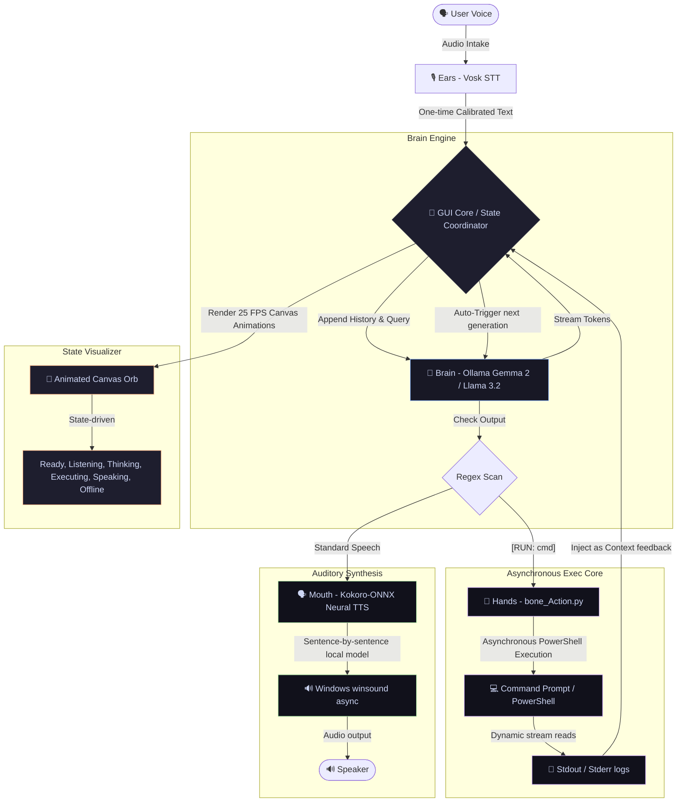

# B.O.N.E. - Futuristic Closed-Loop Agentic Voice Assistant

B.O.N.E. (Brain-Operated Neural Entity) is a futuristic, offline-capable, highly visual personal voice assistant and autonomous local workspace agent. Powered by a hybrid cognitive model framework, Bone features offline neural text-to-speech, local speech recognition, a custom canvas-drawn animated core visualizer, and a closed-loop background execution engine that grants it secure command prompt capabilities to perform real-world tasks on your machine.

---

## 🎨 System Architecture



---

## 🛠️ Core Technology Stack

* **Ears (STT)**: Offline local speech recognition using the **Vosk API** (integrated via `SpeechRecognition`).
* **Brain (LLM)**: Streaming local CPU model inference (via rekomendation **Llama 3.2 3B**) or remote Google Colab GPU-hosted model inference (via recommendations **Gemma 2 9B** or **Llama 3.1 8B**) using **Ollama**.
* **Mouth (TTS)**: Realistic, high-fidelity neural voice synthesis running offline locally using **Kokoro-ONNX v1.0** (Voice model: `af_sarah`).
* **Visual Core (GUI)**: Sleek, high-performance desktop window utilizing **CustomTkinter** in Deep Slate Dark Mode.
* **Hands (Actions)**: Non-blocking, multi-threaded subprocess runner (**`bone_Action.py`**) that interacts directly with Windows PowerShell.

---

## ✨ Premium Features

### 1. Dynamic Canvas AI Core
The sidebar features a custom `tk.Canvas` animating at **~25 FPS (40ms updates)**. It represents Bone's visual "breathing core" and transitions across 6 distinct fluid mathematical styles:
* **BOOTING / TESTING**: Segmented technical outer ring spinning clockwise; yellow breathing inner orb.
* **READY**: Calm, breathing blue sphere pulsing slowly with a satellite particle spinning in orbit.
* **LISTENING**: Glowing green core sending out smooth, expanding sonar radar waves.
* **THINKING**: High-frequency orange pulsing core with three satellites spinning in a 120-degree orbital sequence.
* **EXECUTING**: Dual rotating tech rings spinning in opposite directions (outer cyan, inner purple) representing active console execution.
* **OFFLINE / ERROR**: Heavy, static warning-red core displaying alert ticks.

### 2. Closed-Loop Agent Feedback Loop
When you give Bone a task (e.g. *"Create a folder named 'tests' and verify if it's there"*):
1. **Trigger**: Bone's LLM automatically formats the terminal command inside a special block: `[RUN: mkdir tests && dir]`.
2. **Detection & Visuals**: The GUI thread extracts the command block, changes the canvas state to **EXECUTING**, and runs the subprocess in the background.
3. **Suspension**: The assistant thread blocks cleanly without freezing the user interface.
4. **Execution**: The command executes asynchronously. Stdout/stderr buffers are read by concurrent threads to prevent locks.
5. **Dynamic Feedback**: Once completed, the terminal logs and exit codes are formatted and appended directly back to Bone's conversation history.
6. **Closed Loop**: The assistant thread is unblocked, automatically triggers another LLM generation, and Bone reads the logs to speak the final results to you!

### 3. Tree-Terminated Voice Barge-In
At any moment, clicking **🛑 INTERRUPT VOICE** or pressing **`Escape`**:
* Instantly stops audio playback via `winsound.SND_PURGE`.
* Truncates the assistant conversation history to only the exact words spoken before interruption.
* Triggers an OS-level tree-kill (`taskkill /F /T`) to cleanly terminate any runaway background subprocesses and children.
* Safely returns Bone to **LISTENING** in less than 50 milliseconds.

---

## ⌨️ Keyboard Shortcuts Reference

| Hotkey | Action | Purpose |
|---|---|---|
| **`Escape`** | Interrupt / Cancel | Terminate voice output, cancel active thinking, or force-kill running shell commands immediately. |
| **`Ctrl + R`** | Reset Memory | Clear active conversation history JSON and launch a fresh voice session. |
| **`Ctrl + M`** | Toggle Mute | Mute/Unmute voice output (Bone will communicate purely in text format). |

---

## 🚀 Setup & Local Installation

### 1. Prerequisite Requirements
Make sure you have PyAudio requirements installed on your machine.
* **Windows**: Open terminal and configure a clean virtual environment:
  ```powershell
  python -m venv .venv
  .venv\Scripts\activate
  pip install -r requirements.txt
  ```

### 2. Download Speech Recognition Models
* **Vosk Offline STT**: Download the English model using the built-in tool or let the assistant fetch it:
  ```powershell
  # Download speech model to your virtual environment
  sprc download vosk
  ```
* **Kokoro Neural TTS**: The code will **automatically download** the ONNX model (`kokoro-v1.0.onnx`, 325MB) and the voice database (`voices-v1.0.bin`, 28MB) directly from HuggingFace on its very first launch. No manual downloading required!

### 3. Configure Ollama Server
Bone works locally on CPU or remotely on a free Cloud GPU.
* **Local CPU Mode**:
  1. Download and run [Ollama](https://ollama.com).
  2. Pull a recommended model: `ollama pull llama3.2`.
  3. Inside `bone_Brain.py`, configure `OLLAMA_HOST = None` and `OLLAMA_MODEL = "llama3.2"`.
* **Remote Colab GPU Mode** (Blazing Fast):
  1. Open the Google Colab Notebook.
  2. Add ngrok authorization and configure it to rewrite the host header to bypass safety warnings:
     ```python
     ngrok.connect(11434, "http", host_header="rewrite")
     ```
  3. Inside `bone_Brain.py`, configure `OLLAMA_HOST` to your ngrok URL and `OLLAMA_MODEL = "gemma2"`.

---

## ⚙️ Crucial Engineering Gotchas & Resolutions

During development, we solved several deep-level OS and Python interface issues. We document them here for open-source contributors:

### 1. Kokoro-ONNX 510-Phoneme Engine Crash
* **Problem**: The native `kokoro-onnx` library throws a severe `IndexError` and crashes if a streamed LLM response exceeds 510 characters, as it overflows the engine's built-in phoneme sequence boundary.
* **Resolution**: In `bone_Mouth.py`, we split incoming text into individual sentences dynamically using an optimized regex (`re.split(r'(?<=[.!?])\s+|\n+', text)`). We then synthesize each sentence separately and stream the audio segments sequentially, bypassing the limits cleanly.

### 2. Winsound `PlaySound` UI Freeze & Latency
* **Problem**: Calling standard Windows `winsound.PlaySound(temp_wav, winsound.SND_FILENAME)` runs synchronously, locking Python's execution loop and preventing GUI frames from updating or capturing `Ctrl+C` / `Escape` keypresses mid-speech.
* **Resolution**: We configured winsound to play asynchronously using `winsound.SND_ASYNC`. We then calculate the exact audio duration (`len(samples) / sample_rate`) and run a polling sleep loop in tiny `50ms` slices. This allows Python to remain responsive and instantly intercept key interrupts.

### 3. Ollama 403 ngrok Tunnel Forbidden Blocks
* **Problem**: When tunnelling Ollama from Colab via Ngrok, Ollama validates the incoming HTTP `Host` header and immediately rejects requests with `403 Forbidden` if the host header doesn't match `localhost:11434`.
* **Resolution**: We configured the Ngrok tunnel on the Jupyter side to rewrite the host header to `localhost` dynamically: `ngrok.connect(11434, "http", host_header="rewrite")`. We also configured `OLLAMA_ORIGINS="*"` and `OLLAMA_HOST="0.0.0.0"` in Colab environment variables.

### 4. Orphan subprocess trees on Windows
* **Problem**: When triggering a compound command like `mkdir test && dir`, `subprocess.Popen` spawns a powershell shell. Calling standard `process.terminate()` only kills the parent `powershell.exe` container, leaving child commands running in the background as zombie tasks.
* **Resolution**: In `bone_Action.py`, we implemented OS-level process tree termination on Windows. When an interrupt is triggered, we run a command-line tree-kill:
  ```powershell
  taskkill /F /T /PID <process_pid>
  ```
  This forcefully terminates the parent shell and every child process spawned in its entire execution tree.

### 5. Vosk Microphone Calibration Lag
* **Problem**: Calibrating speech thresholds on every voice command (`adjust_for_ambient_noise`) added a mandatory 1-second lag to every single question, making conversations feel sluggish.
* **Resolution**: In `bone_Ear.py`, we isolated the calibration inside a one-time global startup hook (`_is_calibrated = False`). Bone calibrates ambient noise once when the app launches, removing all lag from subsequent prompts.

---

## 📄 License

This project is licensed under the MIT License - see the [LICENSE](file:///d:/temp/Bone_Persional_Assitent/LICENSE) file for details.
